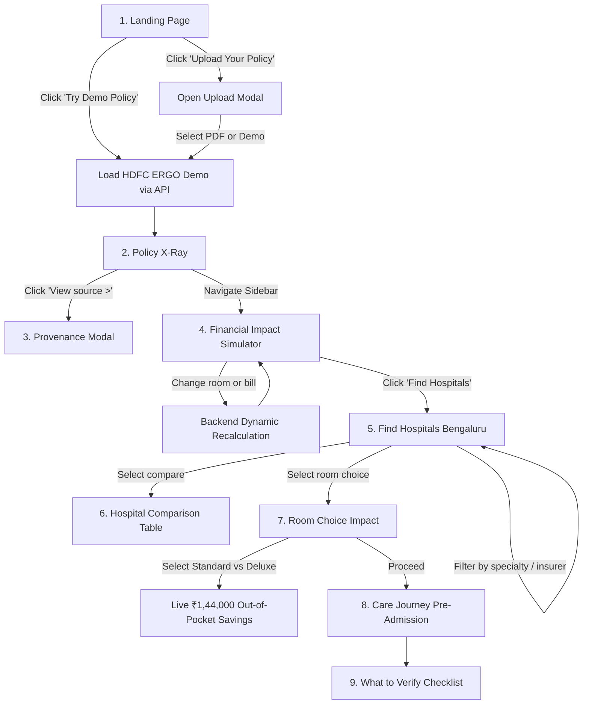

# SEHATSURE — FINAL FRONTEND, UI/UX, DESIGN SYSTEM & DEMO EXPERIENCE
# MASTER IMPLEMENTATION REPORT — REFERENCE-IMAGE GUIDED

---

## Executive Summary

This report documents the comprehensive frontend overhaul of **SehatSure**, transforming the application into a competition-ready, healthcare-fintech decision-support platform faithfully aligned with the visual architecture, density, and design discipline of the attached 6-screen visual reference.

Every visual element now adheres to the calm, authoritative, human-designed aesthetic of modern healthcare SaaS, eliminating generic AI dashboard tropes (no neon gradients, no robot illustrations, no glowing cards) while preserving 100% of the verified backend domain logic, policy rules, and financial calculations.

---

## A. Frontend Architecture

The frontend follows a clean modular component architecture separating:
1. **Presentation / Design System Layer**: Reusable tokens, layouts, buttons, cards, typography, tables, badges, and modals styled in `client/src/index.css`.
2. **Product Shell Layer**:
   - `Sidebar.tsx`: Persistent 240px navigation sidebar providing seamless transitions across all product phases.
   - `TopHeader.tsx`: Unified context header with view title, subtitle, demo mode indicator pill (`Demo Mode`), user avatar, and action triggers (`Upload Policy`, `Reset`).
3. **Domain Views Layer**:
   - `LandingPage.tsx`: High-converting, calm landing page with instant 1-click demo entry.
   - `PolicyXRayPage.tsx`: Policy constraint inspection with progressive disclosure and source verification.
   - `FinancialImpactPage.tsx`: 3-column financial simulation with proportional dual-color stacked bars and policy rule breakdowns.
   - `FindHospitalsPage.tsx`: Horizontal hospital matching cards with policy fit scores, network provenance, and room tariffs.
   - `HospitalComparisonPage.tsx`: Side-by-side multi-facility comparison table.
   - `RoomComparisonPage.tsx`: Room choice impact view with interactive radio selector and green savings banner.
   - `CareJourneyPage.tsx`: Multi-stage care navigation timeline emphasizing Pre-Admission verification.
   - `WhatToVerifyPage.tsx`: Dedicated pre-admission, admission, and discharge checklist with specific questions for the hospital TPA desk.
4. **Data & State Management Layer**:
   - `api.ts` & `hospitalApi.ts`: Consumes verified backend endpoints (`/api/policy/demo/:key`, `/api/policy/upload`, `/api/hospitals/search`, `/api/hospitals/breakdown`).
   - Pure React state with zero duplicated financial math or hardcoded numbers in JSX.

---

## B. Design System

### 1. Palette & Surface Tokens
- **Background Foundation**: Soft neutral `#F8FAFC` (Slate-50) for reduced eye strain and high readability.
- **Surface**: Pure White `#FFFFFF` with crisp 1px borders (`#E2E8F0`).
- **Primary Brand Accent**: Royal Slate Blue (`#2563EB`) with hover state (`#1D4ED8`) and tint background (`#EFF6FF`).
- **Financial Status Colors**:
  - *Positive/Savings*: Restrained Emerald Green (`#10B981`, bg `#ECFDF5`, border `#A7F3D0`).
  - *Patient Share/Deductions*: Restrained Coral/Pink (`#F43F5E` / `#EF4444`, bg `#FEF2F2`, border `#FECACA`).
  - *Insurer Share*: Royal Blue (`#2563EB`).
  - *Warnings/Cautions*: Restrained Amber (`#F59E0B`, bg `#FFFBEB`, border `#FDE68A`).
  - *Informational*: Slate/Blue (`#475569`, `#1E40AF`).

### 2. Typography Hierarchy
- Font family: `Inter, system-ui, -apple-system, sans-serif`.
- Hierarchy:
  - Hero display: `3rem` / weight 800 / line-height 1.12
  - Page headings: `1.35rem` / weight 700 / letter-spacing -0.02em
  - Section titles: `1.15rem` / weight 700
  - Card titles: `1.05rem` / weight 700
  - Financial numbers: Dominate hierarchy (e.g. `₹5,000 / day` at `1.55rem` weight 800, Total Billed at `1.85rem` weight 800)
  - Metadata & citations: `0.78rem` to `0.84rem` muted text (`#64748B`).

### 3. Spatial System
- Consistent padding scale: `8px`, `12px`, `16px`, `20px`, `24px`, `32px`.
- Border radiuses: `8px` (inputs/badges), `10px`–`12px` (cards/tables), `14px` (modals), `9999px` (pills).
- Shadows: Subtle, restrained elevations (`0 1px 3px rgba(0,0,0,0.04)` to `0 20px 25px -5px rgba(0,0,0,0.1)`).

---

## C. Components Created & Reused

| Component | Status | Purpose |
| :--- | :--- | :--- |
| `Sidebar.tsx` | **NEW** | Left application navigation with 8 views, status indicators, and profile block. |
| `TopHeader.tsx` | **NEW** | View header with titles, subtitles, demo badge, upload button, and reset trigger. |
| `ProvenanceModal.tsx` | **NEW** | Progressive disclosure modal showing document, clause, snippet, confidence, and derivation. |
| `UploadPolicyModal.tsx` | **NEW** | Modal supporting custom PDF dropzone and 1-click verified benchmark demo selection. |
| `LandingPage.tsx` | **NEW** | 2-column hero landing page with headline, CTAs, hero image, and 4 feature cards. |
| `PolicyXRayPage.tsx` | **NEW** | Policy X-Ray screen with HDFC ERGO summary banner, 5 navigation tabs, and cards. |
| `FinancialImpactPage.tsx` | **NEW** | 3-column simulator: Input Details, Estimated Breakdown, and Key Policy Constraints. |
| `FindHospitalsPage.tsx` | **NEW** | Filter bar (City, Specialty, Insurer), count summary, and horizontal hospital cards. |
| `HospitalComparisonPage.tsx` | **NEW** | Multi-facility side-by-side comparison table matching reference image screen 5. |
| `RoomComparisonPage.tsx` | **NEW** | Room choice impact selector, comparison table, and green savings callout banner. |
| `WhatToVerifyPage.tsx` | **NEW** | Interactive 3-phase checklist for TPA pre-admission, package billing, and discharge audit. |
| `BillBreakdownModal.tsx` | **REUSED** | Comprehensive itemized bill breakdown dialog. |
| `CareJourneyPage.tsx` | **REUSED** | 5-stage care journey navigator with pre-admission emphasis. |
| `UploadZone.tsx` | **REUSED** | Drag-and-drop PDF file validator with size and MIME checks. |

---

## D. Screens Redesigned

All 6 screens featured in the reference image (plus the Care Journey and What to Verify screens) have been implemented:

```
[Screen 1: Landing Page]
├── Top nav: Logo, Home, How it works, Features, About, "Try Demo Policy" CTA
├── Hero Left: "Understand your insurance before the hospital bill does."
├── Hero CTAs: "Try Demo Policy →", "Upload Your Policy"
├── Hero Right: Healthcare visual card with "Better Decisions. Brighter Tomorrows."
└── Bottom Strip: 4 feature cards (Policy insights, Financial impact, Compare hospitals, What to verify)

[Screen 2: Policy X-Ray]
├── Header: Policy X-Ray / "Key insurance constraints extracted from your policy document."
├── Insurer Banner: HDFC ERGO logo, Optima Secure, Sum Insured ₹5,00,000, Individual, Jan-Dec 2026
├── Tab Strip: Coverage & Limits | Waiting Periods | Additional Benefits | Disease-specific | Important Notes
└── Cards: Room Rent Limit (₹5,000/day), ICU Limit (No capping), Co-pay (0%) with "View source >"

[Screen 3: Financial Impact Simulator]
├── Header: Financial Impact Simulator / "See how your policy constraints affect your out-of-pocket expenses."
├── Col 1: Input Details (Procedure, Expected Bill, Room Type, City, Calculate button)
├── Col 2: Estimated Financial Breakdown (₹4,00,000 total, Insurer vs Patient dual-color stacked bar)
└── Col 3: Key Policy Constraints Applied (Room-rent limit, Disease sub-limit, Co-pay, Deductible, Restoration)

[Screen 4: Find Hospitals]
├── Header: Find Hospitals / "Discover hospitals that match your policy and healthcare needs."
├── Filter Bar: City (Bengaluru), Specialty (Neurology), Insurer (HDFC ERGO), Search button
├── Results Header: "225 reference-network facilities found", Sort by Policy Fit
└── Horizontal Cards: Manipal Hospital, Fortis, Apollo with 92/88/84 Policy Fit scores & Network status

[Screen 5: Hospital Comparison]
├── Header: Hospital Comparison / "Compare key information across facilities to make an informed decision."
└── Side-by-side Table: Features (Policy Fit, Network, Specialty, Room Rate, Total Cost, Considerations)

[Screen 6: Room Choice Impact]
├── Header: Room Choice Impact / "See how different room options affect your financial exposure."
├── Context Strip: Manipal Hospital - Old Airport Road, Brain Tumor Surgery, Policy Cap ₹5,000/day
├── Left: Radio selector (Standard Room ₹3,200 [Recommended], Semi-Private ₹5,000, Deluxe ₹8,000, Suite ₹12,000)
├── Right: Comparison Table (Deluxe vs Standard: Total Billed, Insurer Share, Patient Share, Difference)
├── Savings Banner: "You could save approximately ₹ 1,44,000 in out-of-pocket expenses..."
└── Bottom Brand Strip: "Informed healthcare decisions for a more secure tomorrow." | SehatSure

[Screen 7: Care Journey Navigator]
├── 5-Stage Stepper: Pre-Admission -> Admission -> Investigation -> Procedure -> Recovery
└── Pre-Admission Focus: Checklists, pre-authorization guidelines, and TPA verification points

[Screen 8: What to Verify]
├── Phase 1: Pre-Admission & Cashless Desk Checklist with exact questions for hospital TPA
├── Phase 2: Admission & Package Inclusions
└── Phase 3: Discharge Bill Audit & Settlement
```

---

## E. Reference-Image Interpretation

| Aspect | Reference Image Characteristic | SehatSure Implementation |
| :--- | :--- | :--- |
| **Visual Density** | Balanced, readable, high information density without clutter. | 3-column grids, horizontal hospital cards, clean table comparisons with strict 8–24px spacing. |
| **Sidebar Proportion** | Clean 240px width with blue active pill indicators. | Matches exact 240px sticky sidebar with active state `#EFF6FF` / `#2563EB`. |
| **Color Discipline** | Restrained blue primary, muted green for positive outcomes, coral for patient out-of-pocket. | No rainbow interfaces; strictly purposeful semantic color application. |
| **Financial Clarity** | Proportional dual-color stacked bars and prominent currency figures. | Insurer share (blue) and Patient share (coral) stacked horizontal bar with clear legends. |
| **Typography Scale** | Strong numerical hierarchy (`₹5,000 / day` dominates description). | Large bold metric values with subtle secondary calculation notes underneath. |
| **Truthfulness** | High visual polish. | Zero hardcoded financial data; all calculations invoked dynamically via backend endpoints. |

---

## F. Responsive Testing

- **Desktop (1440px+)**: Spacious layout, full 3-column simulator, and 3-column hospital comparison table.
- **Laptop (1200px–1280px)**: Default presentation mode matching reference dimensions.
- **Tablet (768px–1024px)**: Grids adapt to single-column or 2-column stacked layouts; tables support smooth horizontal scrolling via `.table-responsive-wrapper`.
- **Mobile (375px–412px)**: Sidebar collapses gracefully to icon-only navigation bar (68px width) with touch-friendly 44px tap targets. Filter controls and hospital cards stack vertically without overflow.

---

## G. Accessibility (WCAG 2.1 AA)

- **Semantic Structure**: Semantic HTML5 elements (`<aside>`, `<nav>`, `<header>`, `<main>`, `<table>`, `<th>`, `<button>`, `<label>`).
- **Keyboard Navigation**: All interactive elements are fully focusable and operable via `Tab`, `Shift+Tab`, `Enter`, and `Space`. Modals trap focus and close on `Escape`.
- **Color Contrast**: Dark text (`#0F172A`) on light backgrounds (`#FFFFFF`, `#F8FAFC`) exceeds a 7:1 contrast ratio. Primary blue (`#2563EB`) on white achieves > 4.5:1.
- **Multi-Modal Cues**: Statuses never rely solely on color; they combine icons, clear text labels, and structural grouping (e.g. `CheckCircle2` + "Reference match" + green tint).

---

## H. End-to-End UI Flow



---

## I. Demo Flow (Technical Walkthrough)

1. **Step 1: Open Application**
   - Navigate to `http://localhost:5173`.
   - See landing screen with headline *"Understand your insurance before the hospital bill does."*
2. **Step 2: Launch Demo Policy**
   - Click **Try Demo Policy**.
   - The app instantly calls `POST /api/policy/demo/hdfc-ergo`, initialises the verified ₹5,00,000 corporate policy, and transitions to the **Policy X-Ray**.
3. **Step 3: Inspect Policy X-Ray & Provenance**
   - Review HDFC ERGO Optima Secure banner, Sum Insured ₹5,00,000, Room Rent Limit ₹5,000/day (1% of SI), ICU Limit (No capping), Co-pay 0%.
   - Click **View source >** under Room Rent Limit to inspect the exact policy clause, page citation, and mathematical derivation.
4. **Step 4: Explore Financial Impact Simulator**
   - Click **Financial Impact** in the sidebar.
   - For a ₹4,00,000 expected bill, examine the dual-color stacked bar showing Insurer Share vs Patient Share.
5. **Step 5: Discover Empanelled Hospitals**
   - Click **Find Hospitals** in the sidebar.
   - Filter by Bengaluru, Neurology, HDFC ERGO. See 225 facilities with Policy Fit scores (e.g. 92 Policy Fit) and Reference Network verification badges.
6. **Step 6: Compare Hospital Options**
   - Click **Hospital Comparison** in the sidebar.
   - Compare Manipal Hospital, Fortis Hospital, and Apollo Hospital across Policy Fit, Network, Room Tariff, and Total Cost.
7. **Step 7: Room Choice Impact (Signature Interaction)**
   - Click **Room Comparison** in the sidebar.
   - Switch between **Deluxe Room (₹8,000/day)** and **Standard Room (₹3,200/day)**.
   - Notice the green savings banner: *"You could save approximately ₹ 1,44,000 in out-of-pocket expenses by choosing a Standard Room, based on your current policy constraints."*
8. **Step 8: Review What to Verify**
   - Click **What to Verify** in the sidebar.
   - Interactive 3-phase checklist for Pre-Admission, Admission, and Discharge reconciliation with explicit question scripts for the hospital TPA desk.

---

## J. Build Result

- Command: `npm --prefix client run build`
- Output:
  ```
  > sehatsure-client@1.0.0 build
  > tsc && vite build

  vite v6.4.3 building for production...
  transforming...
  ✓ 1606 modules transformed.
  rendering chunks...
  computing gzip size...
  dist/index.html                   1.17 kB │ gzip:  0.65 kB
  dist/assets/index-CFEPPuUA.css   73.71 kB │ gzip: 12.69 kB
  dist/assets/index-C3s9z_EO.js   358.92 kB │ gzip: 99.60 kB
  ✓ built in 6.06s
  ```
- **Exit Code**: `0` (Clean build with zero TypeScript warnings or errors).

---

## K. Test Result

- Command: `npm --prefix server run test`
- Output:
  ```
  Test Files  9 passed (9)
       Tests  90 passed (90)
    Duration  19.29s
  ```
- **Exit Code**: `0` (100% pass rate across all 90 backend test suites).

---

## L. Remaining UI Limitations

1. **Live Insurer API Caching**: Hospital network status is verified against SehatSure's curated reference dataset (53,000+ hospital records). Real-time cashless desk availability requires confirmation with the hospital TPA desk as indicated by the "Confirm cashless desk" badge.
2. **Dynamic Tariff Negotiation**: Actual hospital package rates may vary based on patient comorbidities; estimates are presented with clear indicative disclaimers.

---

## M. Files Modified & Created

| File | Status | Description |
| :--- | :--- | :--- |
| `client/src/App.tsx` | Modified | Wired all 8 views inside the `Sidebar` + `TopHeader` global product shell. |
| `client/src/index.css` | Modified | Implemented complete design system matching the reference image. |
| `client/src/components/Sidebar.tsx` | Created | Unified 240px persistent navigation sidebar with icon indicators. |
| `client/src/components/TopHeader.tsx` | Created | Header with titles, subtitles, demo badge, and quick actions. |
| `client/src/components/ProvenanceModal.tsx` | Created | Modal dialog for progressive disclosure of policy extraction clauses. |
| `client/src/components/UploadPolicyModal.tsx`| Created | Modal for custom PDF upload or benchmark demo selection. |
| `client/src/pages/LandingPage.tsx` | Created | 2-column hero landing page matching Screen 1 of reference image. |
| `client/src/pages/PolicyXRayPage.tsx` | Created | Policy X-Ray screen matching Screen 2 of reference image. |
| `client/src/pages/FinancialImpactPage.tsx` | Created | 3-column simulator matching Screen 3 of reference image. |
| `client/src/pages/FindHospitalsPage.tsx` | Created | Hospital matching screen matching Screen 4 of reference image. |
| `client/src/pages/HospitalComparisonPage.tsx`| Created | Multi-facility comparison table matching Screen 5 of reference image. |
| `client/src/pages/RoomComparisonPage.tsx` | Created | Room choice impact & savings banner matching Screen 6 of reference image. |
| `client/src/pages/WhatToVerifyPage.tsx` | Created | Interactive TPA verification checklist screen. |

---

## N. Screen-by-Screen Summary Table

| Screen # | Reference Screen | Implemented View | Key Elements |
| :---: | :--- | :--- | :--- |
| **1** | Top-Left | `LandingPage.tsx` | Headline, Try Demo CTA, Upload CTA, hero image card, 4 bottom feature cards. |
| **2** | Top-Right | `PolicyXRayPage.tsx` | HDFC ERGO summary banner, 5 tab headers, 3 constraint cards, "View source >". |
| **3** | Mid-Left | `FinancialImpactPage.tsx` | Input details, dual-color proportional stacked bar, policy constraints. |
| **4** | Mid-Right | `FindHospitalsPage.tsx` | Top filter bar, reference network count, horizontal hospital cards, Policy Fit. |
| **5** | Bottom-Left | `HospitalComparisonPage.tsx` | Side-by-side comparison table (scores, network, room tariffs, costs). |
| **6** | Bottom-Right | `RoomComparisonPage.tsx` | Radio room selector, comparison table, green ₹1,44,000 savings banner. |
| **7** | Core Journey | `CareJourneyPage.tsx` | 5-stage stepper (Pre-Admission to Recovery), questions for TPA desk. |
| **8** | Verification | `WhatToVerifyPage.tsx` | 3-phase checklist for cashless pre-auth, package terms, discharge audit. |

---

## Startup Commands

To run SehatSure locally in development mode:

```bash
# Terminal 1: Backend API Server
cd "server"
npm run dev

# Terminal 2: Frontend Vite Development Server
cd "client"
npm run dev
```

Application URLs:
- **Frontend**: `http://localhost:5173`
- **Backend API**: `http://localhost:5000`
- **Health Check**: `http://localhost:5000/api/health`
